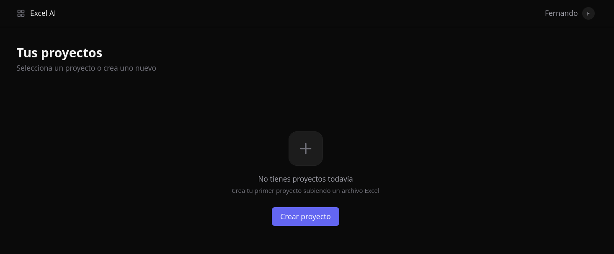
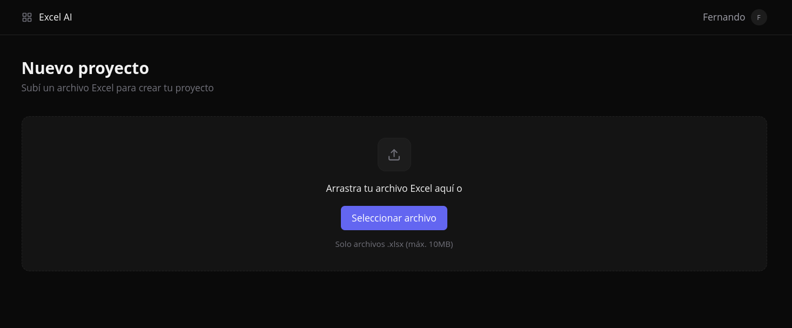
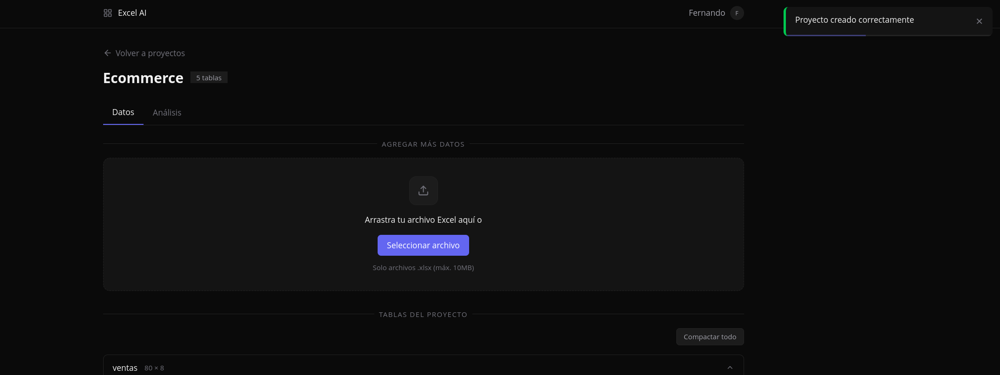
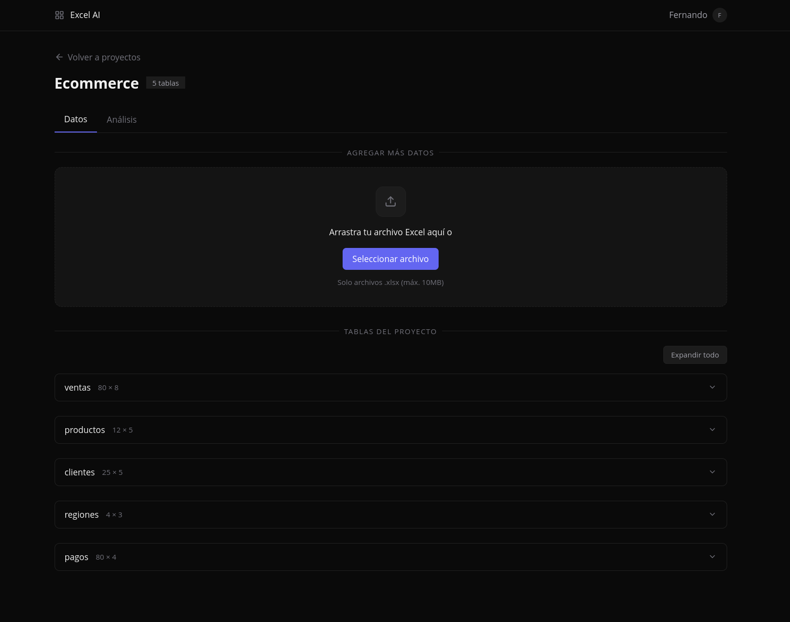
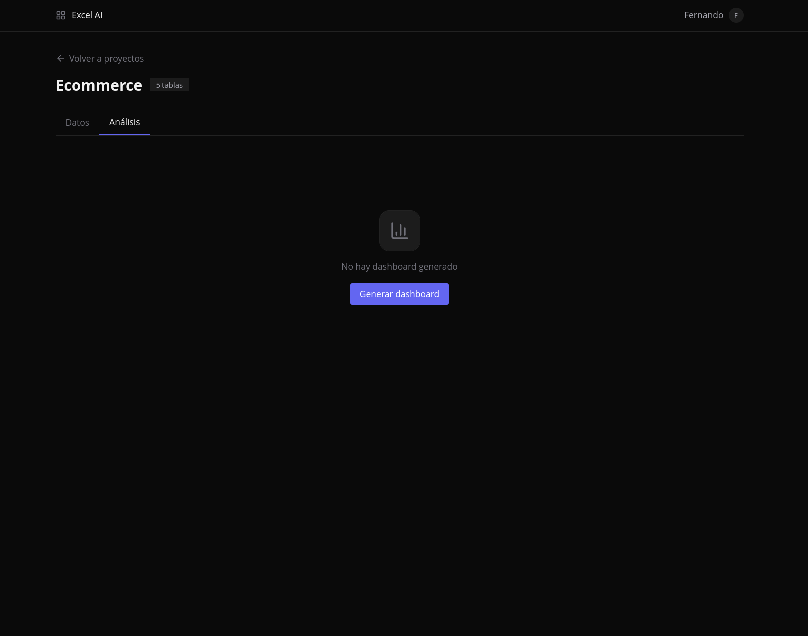

# Presentación — IA Dashboard desde Excel

> Guía visual de todas las funcionalidades de la aplicación.

---

## 1. Bienvenida

Ingresás tu nombre y entrás directamente a tu espacio de trabajo.

<p align="center">
  
</p>

---

## 2. Mis Proyectos

Tu dashboard personal con todos los proyectos. Cada proyecto agrupa uno o más archivos Excel.

<p align="center">
  
</p>

---

## 3. Crear un Nuevo Proyecto

Subís un archivo `.xlsx` y el sistema crea el proyecto automáticamente. Lee todas las hojas del Excel y las convierte en tablas.

<p align="center">
  
</p>

### El proyecto se crea al instante

Todas las hojas del Excel se convierten en tablas con tipos inferidos automáticamente (texto, número, fecha).

<p align="center">
  
</p>

---

## 4. Tab de Datos

En el tab **Datos** ves todas las tablas del proyecto:

- **Expandir/colapsar** cada tabla para ver los datos.
- **Tipos inferidos** por columna (string, number, date).
- **Subir otro Excel** al mismo proyecto — las tablas nuevas se agregan al proyecto existente, no se crea uno nuevo.

> **Importante:** Cuando estás dentro de un proyecto y subís otro Excel, todas esas tablas se agregan al mismo proyecto. El sistema entiende que son datos complementarios, no un proyecto nuevo.

<p align="center">
  
</p>

---

## 5. Generar el Dashboard

En el tab **Análisis**, tocá **"Generar Dashboard"** y el sistema:

1. Analiza todas las tablas y columnas del proyecto.
2. Ejecuta funciones analíticas reales (promedios, agrupaciones, tendencias, correlaciones).
3. Genera KPIs, gráficos e insights automáticos.
4. Muestra un **resumen ejecutivo** como banner arriba del dashboard.

> **Nota:** El resumen ejecutivo es temporal — se muestra al generar o iterar, pero desaparece cuando navegás fuera del tab. Los datos del dashboard se guardan automáticamente en el proyecto.

<p align="center">
  
</p>

### Dashboard generado

El dashboard incluye:
- **KPIs** con valor, formato, tendencia y porcentaje de cambio.
- **Gráficos** de distintos tipos (barras, líneas, pie, scatter, doughnut).
- **Insights** automáticos con severidad (positivos, negativos, advertencias).
- **Resumen ejecutivo** generado por IA.

<p align="center">
  
</p>

---

## 6. Chat Iterativo

El ícono de chat aparece sobre el dashboard generado. Podés pedir cambios en lenguaje natural:

### Tipos de cambios que podés pedir

| Tipo | Ejemplo | Qué hace |
|------|---------|----------|
| **Cosmético** | "Cambiar colores del gráfico a Neón" | Solo cambia colores, sin recalcular datos |
| **Agregar** | "Agregar un gráfico de ventas por región" | Ejecuta nuevas funciones y agrega widgets |
| **Modificar** | "Cambiar el gráfico de barras a líneas" | Cambia el tipo manteniendo los datos |
| **Eliminar** | "Quitar el gráfico de pie" | Elimina widgets y reorganiza |
| **Títulos** | "Cambiar título del KPI de ventas" | Cambia solo ese texto |

### El AI es quirúrgico

Solo modifica lo que pedís. El resto del dashboard se mantiene intacto — mismos datos, mismos colores, mismas posiciones.

> **Cómo funciona:** El sistema envía el dashboard completo al AI con reglas estrictas de preservación. El AI copia los widgets no modificados textualmente y solo altera los que el usuario mencionó.

<p align="center">
  
</p>

### Resultado del cambio

El dashboard se actualiza al instante. El AI confirma qué cambió y qué preservó.

<p align="center">
  
</p>

---

## 7. Funcionalidades Extra

### Proyectos multi-tabla

Un proyecto puede tener tablas de múltiples archivos Excel. Al generar el dashboard, el AI analiza **todas** las tablas juntas y puede cruzar datos entre ellas (join, aggregaciones跨 tabla).

### KPIs con tendencia

Cada KPI muestra:
- Valor formateado (moneda, porcentaje, número)
- Tendencia (↑ ↓ →) con color (verde/rojo/gris)
- Valor de tendencia (porcentaje o valor absoluto)

### Gráficos variados

El sistema elige automáticamente el mejor tipo de gráfico según los datos:
- **Pie/Doughnut** para pocas categorías (≤5)
- **Barras** para categorías medianas (6-8)
- **Barras horizontales** para etiquetas largas
- **Líneas** para series temporales
- **Scatter** para correlaciones
- **Area** para tendencias acumuladas
- **Stacked** para comparaciones por segmento

### Persistencia automática

El dashboard se guarda automáticamente en el proyecto. Al volver a entrar, encontrás todo como lo dejaste — incluyendo las iteraciones por chat.

### Deploy en AWS

La aplicación está desplegada en AWS EC2 y accesible públicamente:
- **Frontend:** http://3.129.10.23:5173
- **API Docs:** http://3.129.10.23:8000/docs

---

## Flujo Completo en Imágenes

```
Bienvenida → Mis Proyectos → Nuevo Proyecto → Datos (tablas)
                                                    ↓
                                          Análisis → Generar Dashboard
                                                    ↓
                                              Chat Iterativo → Modificar
                                                    ↓
                                              Dashboard Final ✅
```
